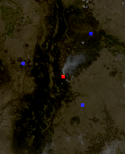
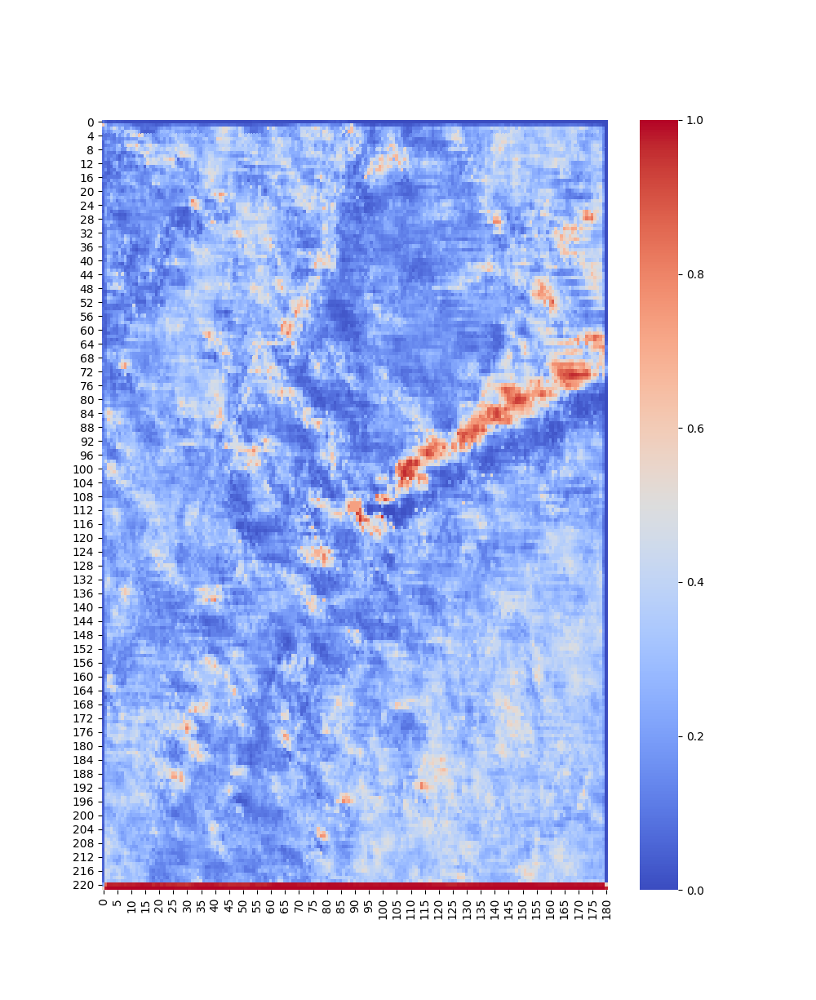

# bushfire_detection

This code base is for training and testing various machine learning models for bushfire classification
in satellite images.

## config.py

Settings must be changed when running program on a different machine

Example directory structure
```
├── data 
|     ├── GOES
|           ├── with_fire  
|           ├── maybe_fire
|           ├── not_fire    
|           ├── outputs  

```

Example config file
```
data = {
    "location": "D:/data/GOES",
    "outputs": "D:/data/GOES/outputs",
    "fire": "with_fire",
    "maybe_fire": "maybe_fire",
    "not_fire": "without_fire"
}
```

<b>location:</b> The absolute root directory of the data
\
<b>outputs:</b> Where the images (generally heatmaps) are stored 
\
<b>fire:</b> The folder where the fire examples are stored
\
<b>maybe_fire:</b> The folder where the maybe fire examples are stored
\
<b>not_fire:</b> The folder where the without fire examples are stored

## read_data.py

This python file handles the reading and formatting of the data. When run directly,
it uses the config file to load all of the images in the fire and maybe_fire directories.
It then slices these images in 5x5x16 sections and labels them as either
fire (1) or not fire (0). 
\
\
An assumption is made that all images have fire in the center as the location of the fire
is hard-coded. In future, this will be dynamically calculated based on the dimensions of the image.



The above image represents which areas are sliced. The red section is labeled as a 1 (fire) where 
as the blue section is labeled as 0 (not fire).

Additionally, to build a larger dataset, the slices around fire were made at multiple
points around the center. For example, if the fire is located at coordinates
(90, 111) then 5x5 slices would be made at 
```buildoutcfg
fire_data = [
        (89, 110), (90, 110), (91, 110),
        (89, 111), (90, 111), (91, 111),
        (89, 112), (90, 112), (91, 112)
    ]
```
Where the x and y coordinates are the center of the 5x5 slice

## models.py

This file applies a model to the training data and produces the heatmap output files.
The process is as follows:

```buildoutcfg
-> Define model
-> Load training set
-> Call 'fit' function on training set
-> Load images and convolution slice across each image
-> Call 'predict' function on the sliced image
-> Subtract non-fire classification from fire classification
-> Use values to plot heatmap (see visualize.py)
-> Save heatmap to output folder
```

In order to run a model the object is required to have a 'fit' and 'predict'
this can be seen in the ann.py file where the neural network model is defined.

## Visualize
This contains all the functions for generating the 2D and 3D heatmaps. 
The model outputs a prediction for each pixel as either 1.0 for extremely probable of fire
or 0.0 for no fire. Confidence values can output as float values between 0 and 1
which create a gradient. See colour bar in the image below
